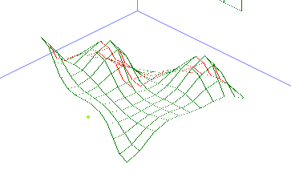

# B-Spline Surface (RGB Shading) - Perspective and Axonometric

## Atributos do Programa

- **Superfície B-Spline**: Implementação de superfícies B-Spline com controle de pontos.
- **Visualização RGB**: Representação das superfícies com cores RGB.
- **Sombreamento**: Suporte para wireframe, sombreamento constante, sombreamento Gouraud e sombreamento Phong.
- **Perspectiva**: Visualização em perspectiva para uma melhor compreensão da profundidade.
- **Axonométrica**: Visualização axonométrica para uma representação isométrica.
- **Interatividade**: Interface interativa para manipulação dos pontos de controle.
- **Renderização**: Algoritmo incremental para renderização das superfícies.
- **Transformações**: Suporte para transformações geométricas como translação, rotação e escala.
- **Recorte**: Suporte para recorte de superfícies.
- **Z-Buffer**: Implementação de Z-Buffer para ocultação de superfícies.

## Program Attributes

- **B-Spline Surface**: Implementation of B-Spline surfaces with control points.
- **RGB Visualization**: Representation of surfaces with RGB colors.
- **Shading**: Support for wireframe, flat shading, Gouraud shading, and Phong shading.
- **Perspective**: Perspective visualization for better depth understanding.
- **Axonometric**: Axonometric visualization for isometric representation.
- **Interactivity**: Interactive interface for manipulating control points.
- **Rendering**: Incremental algorithm for surface rendering.
- **Transformations**: Support for geometric transformations such as translation, rotation, and scaling.
- **Clipping**: Support for surface clipping.
- **Z-Buffer**: Implementation of Z-Buffer for surface occlusion.

Light Position

Rotation
